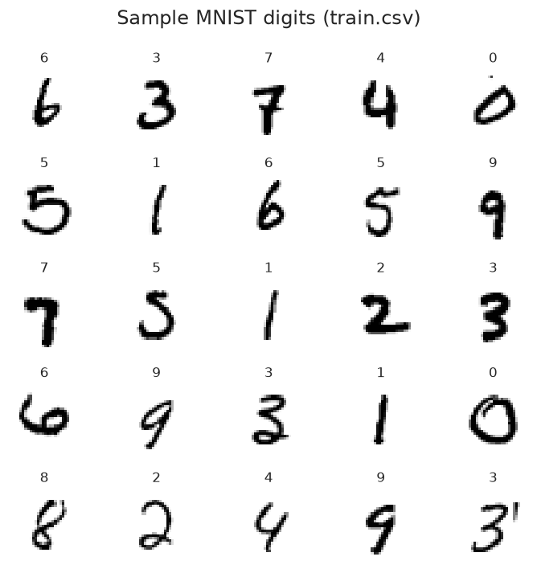
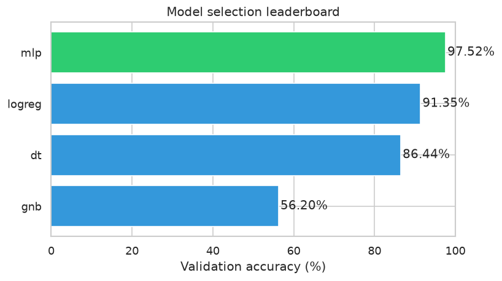
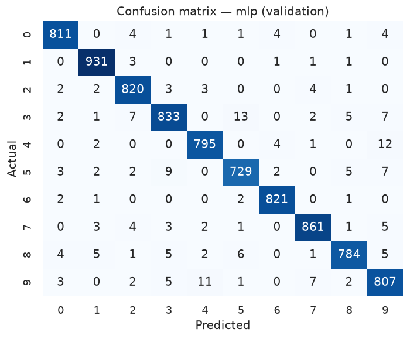
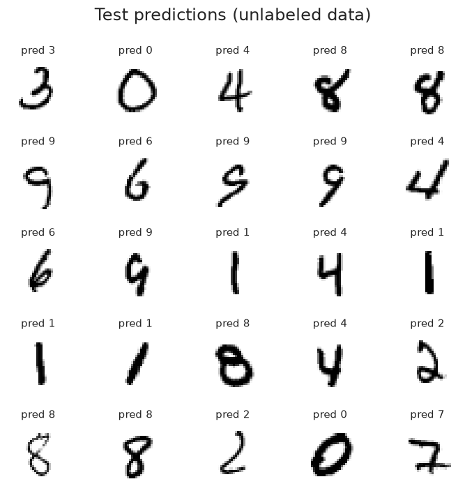

# Digit Recognizer — Computer Vision with MNIST

Handwritten digit classification (0–9) with classical baselines vs. an MLP neural network. **Two-phase workflow**: model selection on a validation split, then full-data retraining and Kaggle submission.

## Results at a glance

| Metric | Value |
|--------|-------|
| Best model | **MLP (256→128 hidden layers)** |
| Validation accuracy | **97.5%** |
| Baselines | LogReg 91.3% · DT 86.4% · GNB 56.2% |
| Test predictions | 28,000 rows |
| Model artifact | `outputs/model.joblib` |

Metrics from the latest run are saved in [`docs/assets/run_summary.json`](docs/assets/run_summary.json).

## Visual results









## Key takeaways

- **MLP beats classical baselines** clearly (~97.5% vs LogReg ~91%, DT ~86%, GNB ~56%).
- **Gaussian NB is weak** because it assumes pixel independence — false for images.
- Scaling pixels to `[0, 1]` plus a two-phase flow (select → retrain on full data) keeps the pipeline compact and reproducible.

## Quick start

```bash
pip install -r requirements.txt
jupyter notebook mnist_digit_recognizer.ipynb
```

Run all cells top to bottom. The notebook:
1. Loads `data/train.csv` and `data/test.csv`, does EDA (sample digits, class balance).
2. **Phase 1** — trains LogReg, Gaussian NB, Decision Tree, and MLP on an 80/20 split; picks the best by validation accuracy.
3. **Phase 2** — retrains the best model on all 42,000 rows, predicts the 28,000 test images, and writes `outputs/submission.csv`.
4. Saves `outputs/model.joblib`, `docs/assets/run_summary.json`, and README charts.

## Project structure

```
mnist-digit-recognizer/
├── mnist_digit_recognizer.ipynb   # main notebook (EDA → selection → retrain → submission)
├── data/
│   ├── train.csv
│   └── test.csv
├── docs/
│   └── assets/                    # README charts + run_summary.json (committed)
├── outputs/                       # model.joblib + submission.csv (gitignored)
└── requirements.txt
```

## Dataset

[Kaggle Digit Recognizer](https://www.kaggle.com/competitions/digit-recognizer) — MNIST handwritten digits. `train.csv` has a `label` column plus 784 pixel columns (28×28 grayscale); `test.csv` has pixels only.
